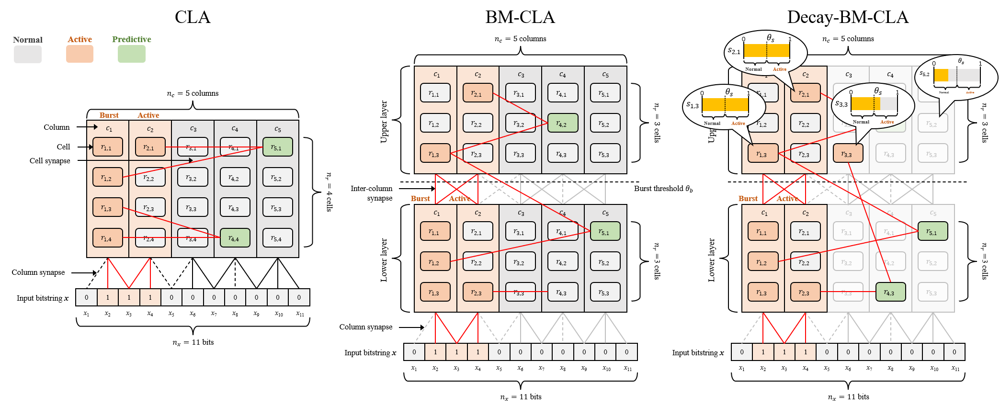

# Multi-layer Cortical Learning Algorithm for Forecasting Time-series Data with Smoothly Changing Variation Patterns

This repository contains the C++ implementation of Decay-BM-CLA on the following paper.

- **Title**: Multi-layer Cortical Learning Algorithm for Forecasting Time-series Data with Smoothly Changing Variation Patterns
- **Authors**: Kazushi Fujino, Keiki Takadama, and Hiroyuki Sato.

The majority of the implementation is based on [htm.core](https://github.com/htm-community/htm.core).


## Introduction

The Cortical Learning Algorithm (CLA) is a time-series forecasting algorithm based on the human neocortex. An extended version, Burst-based Multilayered CLA (BM-CLA), features a dual CLA predictor comprising upper and lower layers to handle multiple variation patterns. The lower layer receives time-series data, while the upper layer detects changes in variation patterns based on the success or failure of predictions in the lower layer and adjusts the states in the lower layer to fit the current variation pattern. The new version, Decay-BM-CLA, determines the states in the upper layer using active strengths that decay at every time step to improve forecasting accuracy on time-series data with smoothly changing variation patterns. The states in the upper layer gradually change as time progresses, facilitating the adjustment of states in the lower layer to smoothly match the changing variation patterns in the data.



## Features

This repository contains implementations of the following features

- [x] [CLA](https://www.jstage.jst.go.jp/article/jaciii/25/4/25_450/_article/-char/ja/)
  - This was implemented using htm.core.
- [x] [BM-CLA](https://www.jstage.jst.go.jp/article/jsp/27/4/27_69/_article/-char/ja/)
- [x] [Adaptive Synapse Adjustment(ASA)](https://ieeexplore.ieee.org/document/10002035)
  - Synaptic connection optimizer for CLA based on internal prediction accuracy.
- [x] Decay-BM-CLA

## Installation

This section describes only how to install this repository with Windows and Visual Studio. If you want to know other installations, please refer to [htm.core](https://github.com/htm-community/htm.core). (Note that codes added in this repository possibly do not work correctly on other installations.)

### Requirements
- Windows 10
- Visual Studio 2019 ver 16.3.5 and later version
- CMake 3.17.0-rc2 and later version

### Setup

1. Clone codes and run startup script.
	```cmd
	> git clone https://github.com/kfujino-0001/Decay-BM-CLA.git
	> startupMSVC.bat
	```

2. Set mlcla_core project as the startup project on Visual Studio.
3. Build and run BM-CLA.

## Usage

- By switching the config file in `src/lab/main.cpp`, you can switch between algorithms.

|Algorithm|Config file|
|:--|:--|
|CLA|`config/cla_params.json`|
|CLA+ASA|`config/cla_asa_params.json`|
|BM-CLA|`config/bm_cla_params.json`|
|BM-CLA+ASA|`config/bm_cla_asa_params.json`|
|Decay-BM-CLA|`config/decay_bm_cla_params.json`|
|Decay-BM-CLA+ASA|`config/decay_bm_cla_asa_params.json`|

```c++
// src/lab/main.cpp

...

int main(int argc, char** argv) {
	const std::string baseDir = "..\\..\\..\\";

	const std::string configFile = baseDir + "config\\cla_params.json"; // cla
	// const std::string configFile = baseDir + "config\\cla_asa_params.json"; // cla + asa
	// const std::string configFile = baseDir + "config\\bm_cla_params.json"; // bm-cla
	// const std::string configFile = baseDir + "config\\bm_cla_asa_params.json"; // bm-cla + asa
	// const std::string configFile = baseDir + "config\\decay_bm_cla_params.json"; // decay-bm-cla
	// const std::string configFile = baseDir + "config\\decay_bm_cla_asa_params.json"; // decay-bm-cla + asa

	const std::string outputDir =  baseDir + "log\\";
	const int nbTrain = 100000;
	const int nbCycle = 100;
	const int seed = 1;

	...
	
	// learn the environment
	model->fit(nbTrain, 0u, env, callback);

	return 0;
}
```
